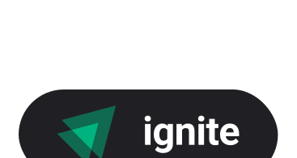
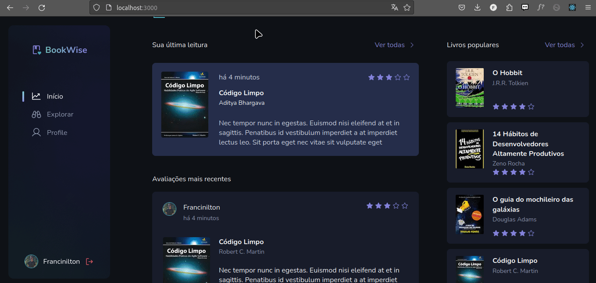

    

<h1 align="center" >🚀 Ignite Desafio Book Wise</h1>

 Uma aplicação full stack altamente abrangente dedicada à avaliação de livros e ao compartilhamento de comentários.Neste desafio foi integrado as tecnologias Next.js e NextAuth.js para autenticar os usuários por meio de suas contas no Google e no GitHub.

## 📷 Preview

